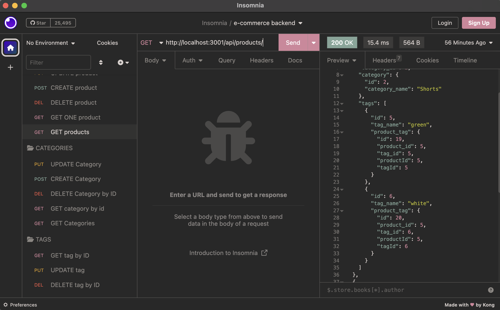

# e-commerce-backend

## Description
This is a backend project that creates routes for product, tag, and category tables to perform all of the CRUD operations. It simulates an e-commerce website where categories would have multiple products, which would have multiple tags. There are routes to view all, view by id, update by id, delete by id, and create new on each of the endpoints.

## Installation

```
git clone
``` 
```
cd into repo
```
```
npm i (or npm install)
```

## Usage

[Link to walkthrough video](https://drive.google.com/file/d/1mOXzn9NdFEsga_ju0WltN0KVv4bDtSOv/view)

Before you start, you will need to create a .env file and define your environment variables.<br/>
Then, you will need to sign into your mysql shell and run
```
SOURCE db/schema.sql;
```
From the root of the folder. Then, run
```
npm run seed
```
This should get your database ready with the data. To use the application, just run 
```
node server.js
```
from the root of the repo. Test endpoints in Insomnia or similar software!



## Credits
- UPenn bootcamp for the front end code
- Justin Pauldo, Anthony Cedrone, Layne Nigro, and Eric Kim for debugging and through tables